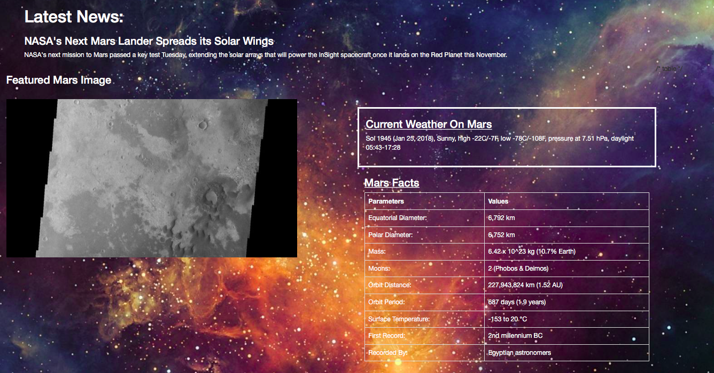

<h1>Mars Web Application</h1>

Instructions: In this project, the goal was to build a web application that scrapes various websites for data related to the Mission to Mars and displays the information in a single HTML page.

tools used:
<ul>
<li>Splinter</li>
<li>Pandas</li> 
<li>HTML & CSS</li>
<li>MongoDB</li>
<li>Flask</li>
</ul>

<h3>Results</h3>

